# 🚀 WorkHub — Productivity & Project Management System

[](https://laravel.com)
[](https://php.net)
[](https://pestphp.com)
[](https://phpstan.org)
[](LICENSE)

**WorkHub** is a high-performance productivity, task tracking, and team collaboration suite built with **Laravel 12**. It combines Notion-like inline table editing with multi-workspace organization permissions, rich documentation management, integrated GitHub issue reporting, and automated CI/CD pipeline notifications.

---

## 📸 Screenshots Showcase

<table width="100%">
  <tr>
    <td width="50%" align="center">
      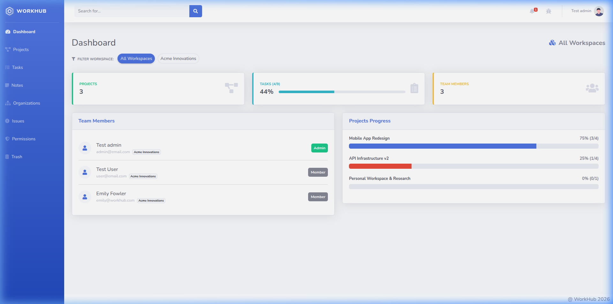
      <br><sub><b>📊 Dashboard & Workspace Analytics</b></sub>
    </td>
    <td width="50%" align="center">
      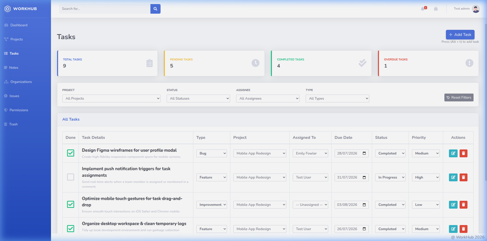
      <br><sub><b>⚡ Inline AJAX Task Grid</b></sub>
    </td>
  </tr>
  <tr>
    <td width="50%" align="center">
      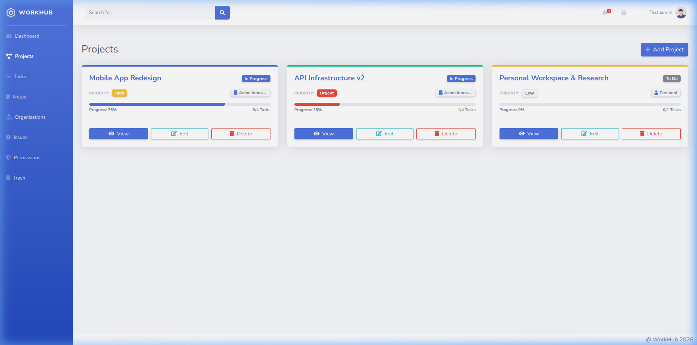
      <br><sub><b>📁 Projects & Workspace Management</b></sub>
    </td>
    <td width="50%" align="center">
      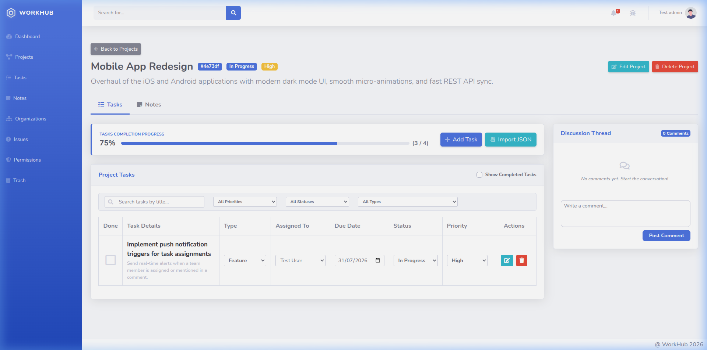
      <br><sub><b>🎯 Project Details & Task Board</b></sub>
    </td>
  </tr>
  <tr>
    <td width="50%" align="center">
      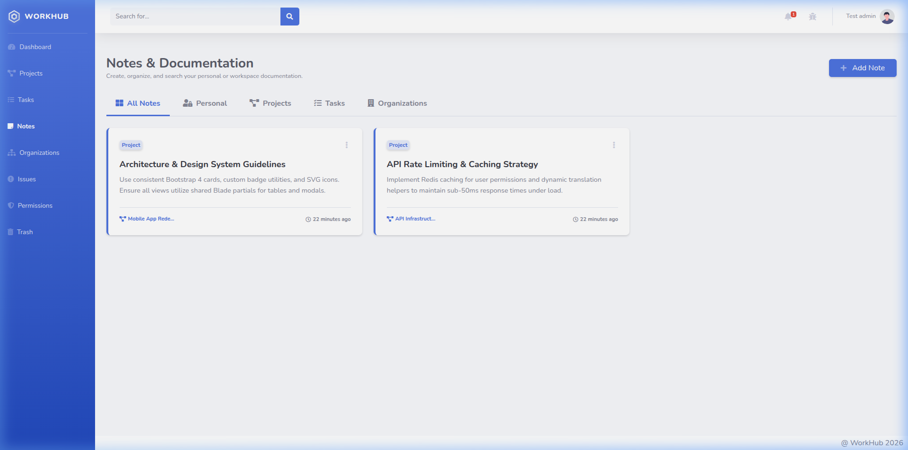
      <br><sub><b>📝 Rich Notes & Docs Center</b></sub>
    </td>
    <td width="50%" align="center">
      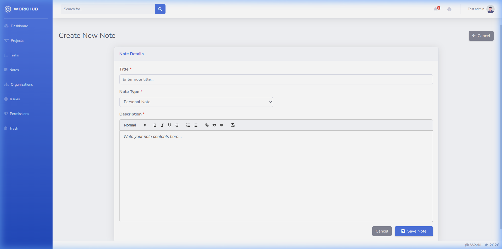
      <br><sub><b>✍️ Rich Text Note Editor & PDF Export</b></sub>
    </td>
  </tr>
  <tr>
    <td width="50%" align="center">
      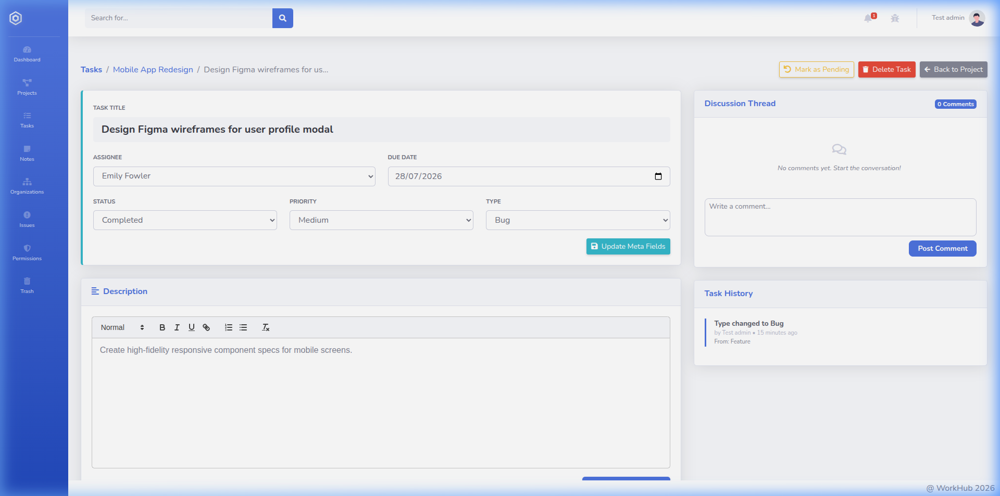
      <br><sub><b>🔍 Task Details & Audit Log History</b></sub>
    </td>
    <td width="50%" align="center">
      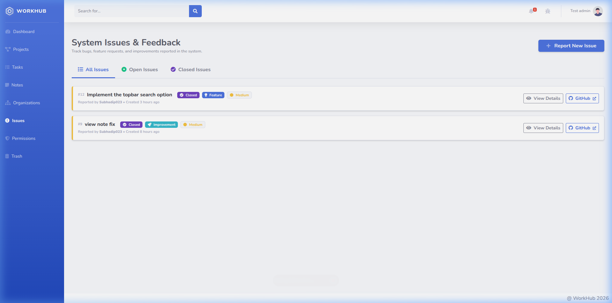
      <br><sub><b>🐛 Integrated Issue Tracker</b></sub>
    </td>
  </tr>
  <tr>
    <td width="50%" align="center">
      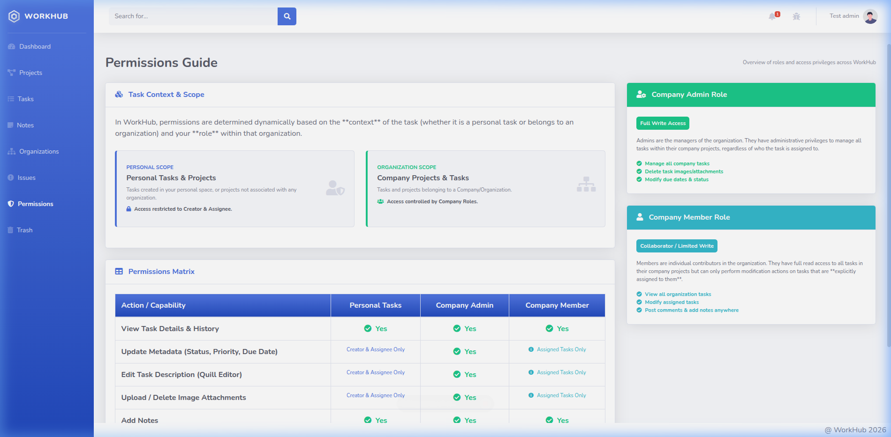
      <br><sub><b>🔒 Role-Based Permissions Matrix</b></sub>
    </td>
    <td width="50%" align="center">
      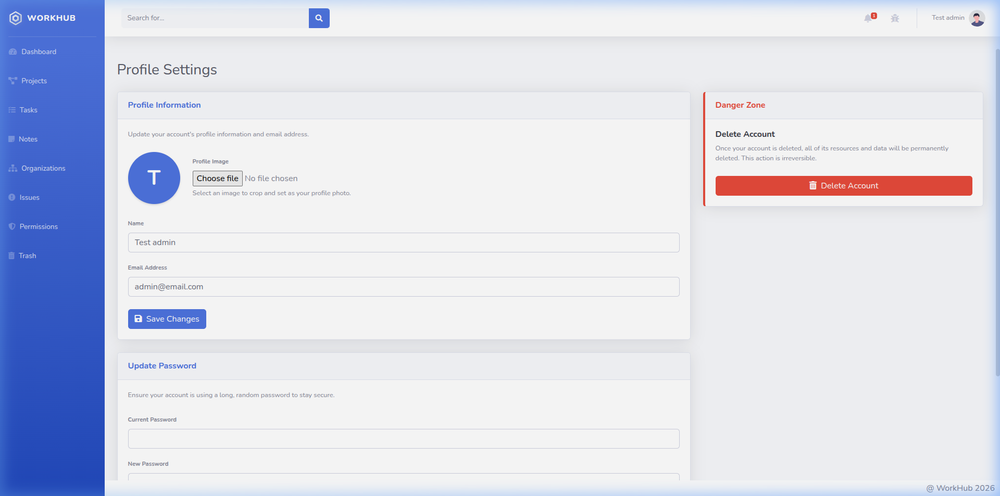
      <br><sub><b>👤 User Profile & Avatar Management</b></sub>
    </td>
  </tr>
  <tr>
    <td width="50%" align="center">
      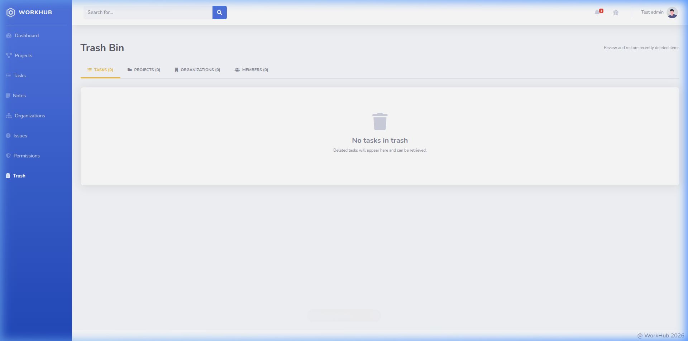
      <br><sub><b>🗑️ Soft-Delete Trash Bin</b></sub>
    </td>
    <td width="50%" align="center">
      
      <br><sub><b>🔑 Clean Authentication Interface</b></sub>
    </td>
  </tr>
</table>

---

## ✨ Key Features

- ⚡ **Inline AJAX Task Management**: Notion-like inline editing for **Type, Project, Assignee, Due Date, Status, & Priority** directly in the grid with real-time feedback and state sync.
- 🏢 **Multi-Workspace & Organization Contexts**: Switch seamlessly between personal workspaces and team organizations with granular role-based policy authorization (`TaskPolicy`, `CompanyPolicy`).
- 📝 **Rich Documentation Center**: Create project and personal notes using a rich text editor and export them as formatted PDF documents.
- 🐛 **GitHub Issue Integration**: Native issue reporting tool powered by GitHub PAT integration for direct bug submission.
- 📜 **Complete Task History & Audit Logs**: Tracks every task state transition (status, priority, deadline, assignee) with timestamps and user details.
- 🗑️ **Trash Bin & Resource Recovery**: Soft-delete functionality for tasks, projects, and organizations with an automated 30-day auto-prune console command.
- 📬 **CI/CD & Automated Email Dispatch**: GitHub Actions pipeline equipped with Pint linting, PHPStan static analysis, Pest test suite, and automated SMTP HTML email execution reports.

---

## 🛠️ Technology Stack

| Layer | Technology |
| :--- | :--- |
| **Framework** | Laravel 12.x |
| **PHP Version** | PHP 8.2+ |
| **Database** | MySQL / SQLite |
| **Frontend** | Blade Templates, Vanilla JS (Fetch API), Bootstrap 4 (SB Admin 2) |
| **Testing** | Pest PHP (156 Automated Feature Tests) |
| **Code Quality** | PHPStan (Level 5 Clean), Laravel Pint |
| **Automation** | GitHub Actions CI/CD Pipeline & SMTP Mail Engine |

---

## 🚀 Quick Start & Local Setup

### 1. Clone the repository & Install Dependencies
```bash
git clone https://github.com/your-username/WorkHub.git
cd WorkHub

composer install
npm install
```

### 2. Environment Configuration
```bash
cp .env.example .env
php artisan key:generate
```

Ensure your database configuration in `.env` is set up properly.

### 3. Database Migration & Seeding
```bash
php artisan migrate:fresh --seed
```

#### 🔑 Default Test Credentials:
- **Admin User**: `admin@email.com` / Password: `12345678`
- **Standard User**: `user@email.com` / Password: `12345678`

### 4. Run Development Server
```bash
# In separate terminals or using composer dev
npm run dev
php artisan serve
```

Access the application at `http://localhost:8000` or `http://workhub.test/`.

---

## 🧪 Testing & Quality Assurance

Run the unified CI quality check command to execute linting, static analysis, and feature tests:

```bash
composer ci-check
```

Or run test suites independently:
```bash
./vendor/bin/pest
./vendor/bin/phpstan analyse
./vendor/bin/pint --test
```

---

## 📄 License

The WorkHub platform is open-source software licensed under the [MIT license](LICENSE).
